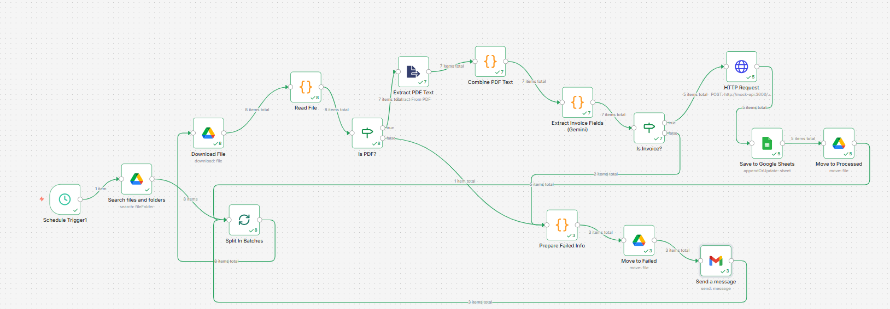
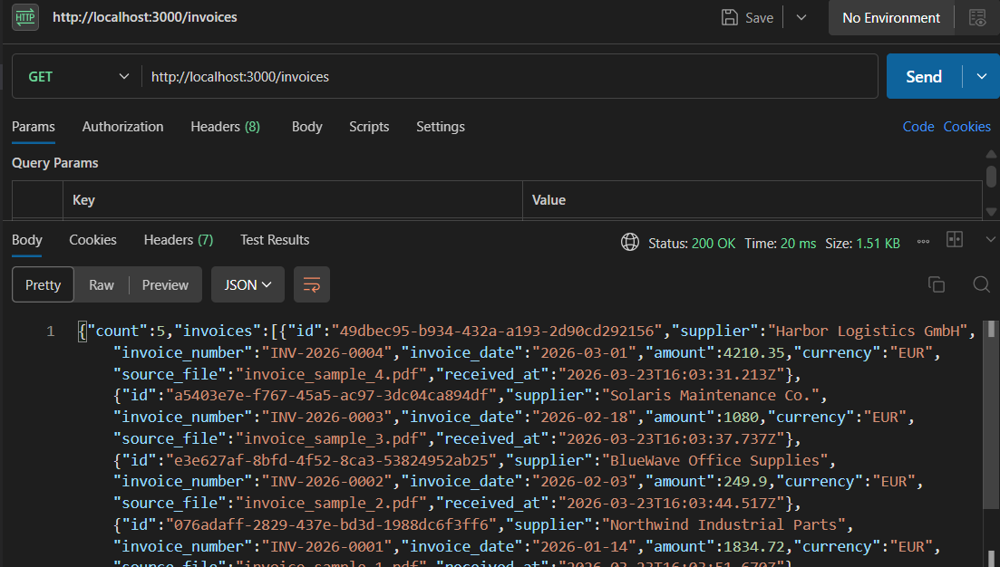
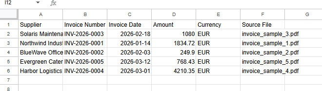

#   Invoice Processing Automation

An **n8n-based automation system** that monitors a Google Drive folder, processes invoice files, extracts structured data using **Gemini AI**, stores results in Google Sheets and a REST API, and organises files into outcome-based folders.

---

##  Key Features

*  Fully automated invoice processing (no manual steps)
*  PDF invoice text extraction
*  AI-powered data extraction using Gemini
*  Google Sheets integration for reporting
*  REST API integration (mock backend)
*  Automatic file organisation (Processed / Failed)
*  Fault-tolerant workflow (no crashes on bad files)
*  Batch processing (handles multiple files sequentially)
*  Secure (no hardcoded credentials)

---

##  Architecture Overview

```
Google Drive Trigger (Inbox folder) [Every month ]
        │  
        ▼
   n8n Workflow
   ┌─────────────────────────────────────────────────────┐
   │  List files                                         │
   │        │                                             │
   │  Split In Batches (1 file at a time)                 │
   │        │                                             │
   │  Download File                                      │
   │        │                                             │
   │  Read file (PDF only)                               │
   │        │                                             │
   │     Is PDF?                                         │
   │    ┌────┴────┐                                      │
   │   Yes        No                                     │
   │    │          │                                     │
   │ Extract Text  Move to Failed                        │
   │    │                                                │
   │ Gemini AI Extraction                               │
   │    │                                                │
   │ Validate Invoice                                   │
   │    │                                                │
   │ ┌──┴───────┐                                        │
   │ Yes       No                                        │
   │  │         │                                        │
   │ Save       Move to Failed                           │
   │ Sheets + API                                        │
   │  │                                                  │
   │ Move to Processed                                   │
   │  │                                                  │
   │  Loop back to Split In Batches                    │
   └─────────────────────────────────────────────────────┘
        │                          │
  /Processed folder          /Failed folder
```

---

##  Prerequisites

* **Docker** ≥ 24.x and **Docker Compose** ≥ 2.x
* **n8n** (runs via Docker in this project)
* A **Google account** with access to Google Drive and Google Sheets
* A **Google Cloud project** with:

  * Google Drive API enabled
  * Google Sheets API enabled
* A Google OAuth 2.0 **Client ID + Secret** (Web Application type)
* A free **Gemini API key** from https://aistudio.google.com
* Internet connection (required for Gemini API requests)

###  Google Drive folder structure

* `Inbox` – upload invoice files here
* `Processed` – successfully processed invoices
* `Failed` – files that could not be processed

###  Google Sheets setup

A Google Sheet with the following columns:

`Supplier | Invoice Number | Invoice Date | Amount | Currency | Source File `

---

##  Environment Variables

Create a `.env` file:

```bash
GEMINI_API_KEY=your_api_key_here
INCOMING_FOLDER_ID=your_folder_id_here
PROCESSED_FOLDER_ID=your_folder_id_here
FAILED_FOLDER_ID=your_folder_id_here
API_KEY=your_mock_api_key
```

---

##  Setup Instructions

### 1 – Unzip the project

```bash
unzip invoice-automation.zip
cd invoice-automation
```

### 2 – Create your `.env` file

```bash
cp .env.example .env
```

Fill in all required values.

---

### 3 – Start the containers

```bash
docker compose up -d
```

This will start:

* **n8n** → http://localhost:5678
* **mock-api** → http://localhost:3000

Verify:

```bash
docker compose ps
curl http://localhost:3000/health
```

---

### 4 – Configure Google credentials in n8n

1. Open http://localhost:5678
2. Go to **Settings → Credentials → Google Drive OAuth2 API**
3. Enter your credentials
4. Set redirect URI:

```
http://localhost:5678/rest/oauth2-credential/callback
```

5. Connect and repeat for Google Sheets

---

### 5 – Import the workflow

* Go to **Workflows → Import**
* Select: `workflows/invoice_processing.json`

Reconnect credentials when prompted.

---

### 6 – Restart after environment setup

```bash
docker compose down
docker compose up -d
```

---

### 7 – Activate the workflow

Set workflow to **Active**

---


## 🖼️ Workflow Preview

### n8n Workflow



## MOCK API



### Google Sheet



##  How to Test

###  Valid Invoice

1. Upload a PDF invoice to `Inbox`
2. Wait ~1 minute
3. Verify:

   * Data appears in Google Sheets
   * File moves to `/Processed`
   * API receives data

---

###  Invalid File

1. Upload non-invoice file
2. File moves to `/Failed`
3. No data stored

---

##  Mock API

### Auth Header

```
X-Api-Key: your-api-key
```

### Endpoints

| Method | Endpoint  |
| ------ | --------- |
| GET    | /health   |
| POST   | /invoices |
| GET    | /invoices |


##  Design Decisions

### AI-Based Extraction

Uses Gemini AI instead of regex to handle:

* Multiple invoice formats
* Different layouts
* Unstructured data


### Batch Processing

Uses **Split In Batches**:

* Processes files one-by-one
* Prevents workflow crashes
* Ensures all files are processed


### Fault Tolerance

* No crashes on bad files
* All files end in Processed or Failed
* Easy debugging via n8n logs


##  Security

* No API keys stored in repository
* Uses environment variables
* `.env` excluded from Git


##  Limitations

* Only PDF invoices supported
* Accuracy depends on text quality
* Requires internet for AI


##  Enhancements

* XML support (future improvement)
* Email notifications
* Database integration
* Advanced validation rules


##  Stopping

```bash
docker compose down
```

Remove data:

```bash
docker compose down -v
```

##  Author

Sapana Dhami

